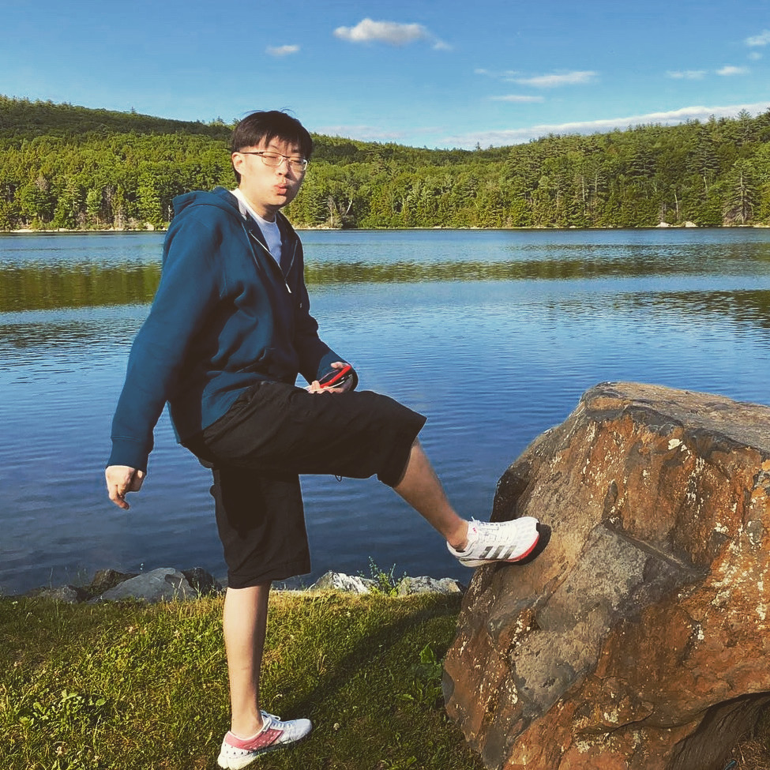
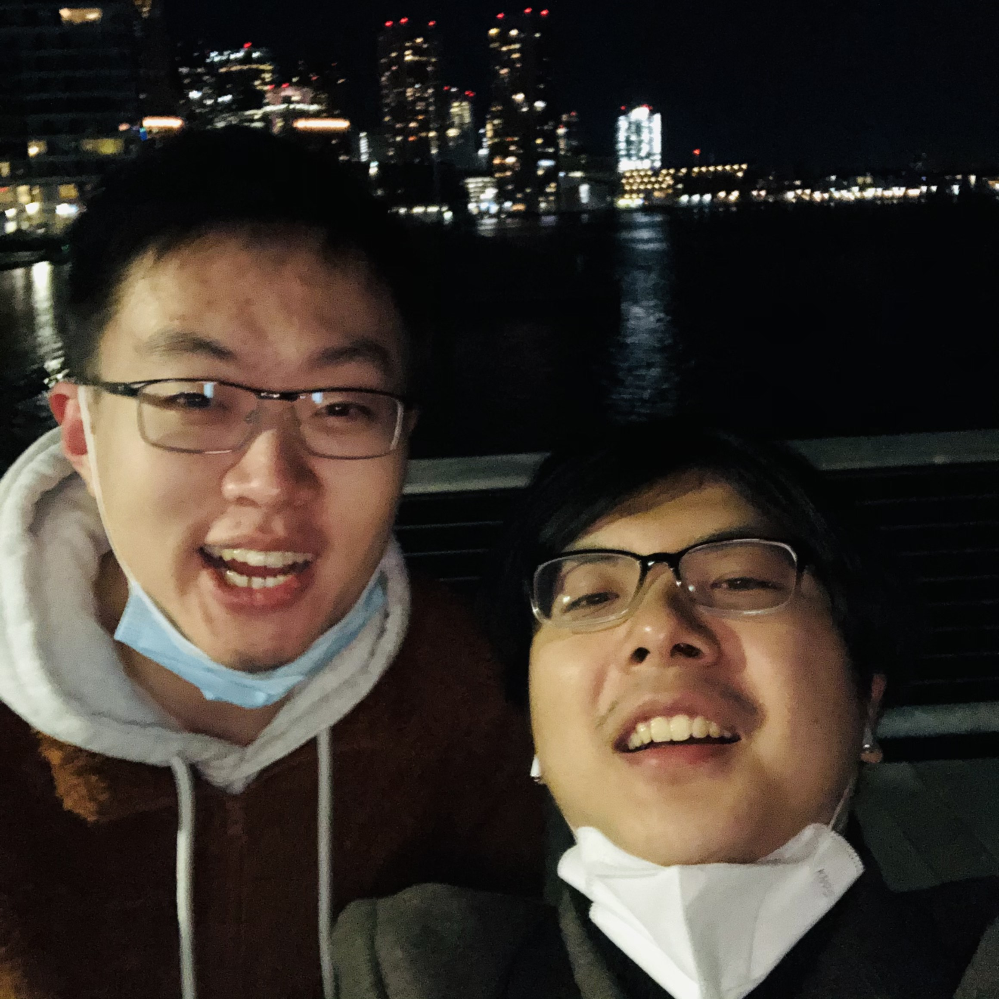
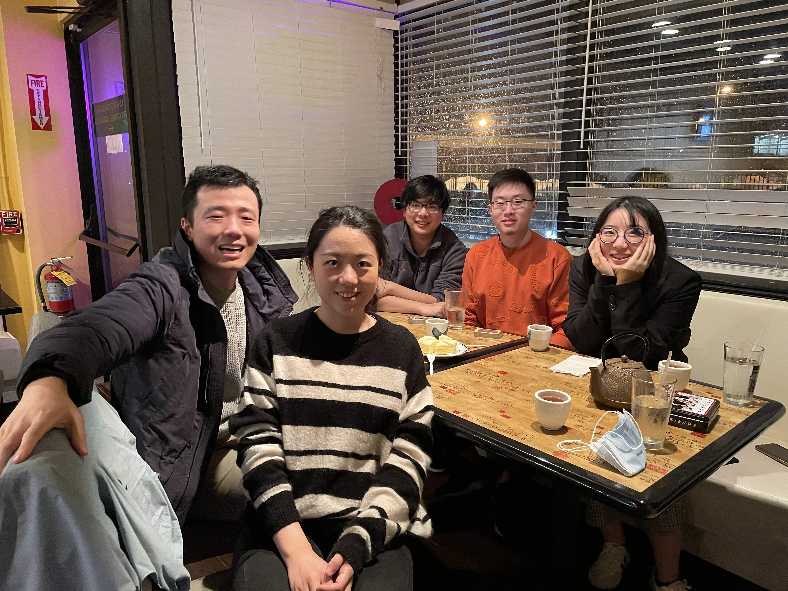

Peizhao was born and raised in Beijing, China. He fortunately spent his first 22 years in this lovely city with his dear family and friends.
He still always recalls his happiest time in Beijing No.2 high school, where the flexible and supportive culture left him an unforgettable memory.

In his spare time, he enjoys playing soccer and guitar (learn guitar from [Su Bing](https://space.bilibili.com/360217593?spm_id_from=333.788.b_765f7570696e666f.2)), 
watching Premier League (being a fan of Liverpool since 2014, and also a supporter of Beijing Guoan), investment, or sharing interesting or thought-provoking things that are going on in his life on Weibo.

Photographed by Jiayu Chen@Boston Lot Lake, NH, Summer 2020.

The last day of 2020@Seaport, Boston. I am very fortunate to have Zizhang with me as my friend, colleague, and personal chef in Boston.

Christmas Day 2020@Sei Bar Wakefield. From left to right: Haoyu Wang (a successful Ph.D. and a reliable man), Qi Liu (she brings joy and fun to the people around), Zizhang Chen, Me, and Huiru Yu (a tender and sensitive girl who I continually learn from).

I want to sincerely thank my father and mother who offer me unconditional love although we are not in a perfect family, my grandmother in heaven who carry out my elementary education, and all my supportive family members, even though 
they might never step into this page.